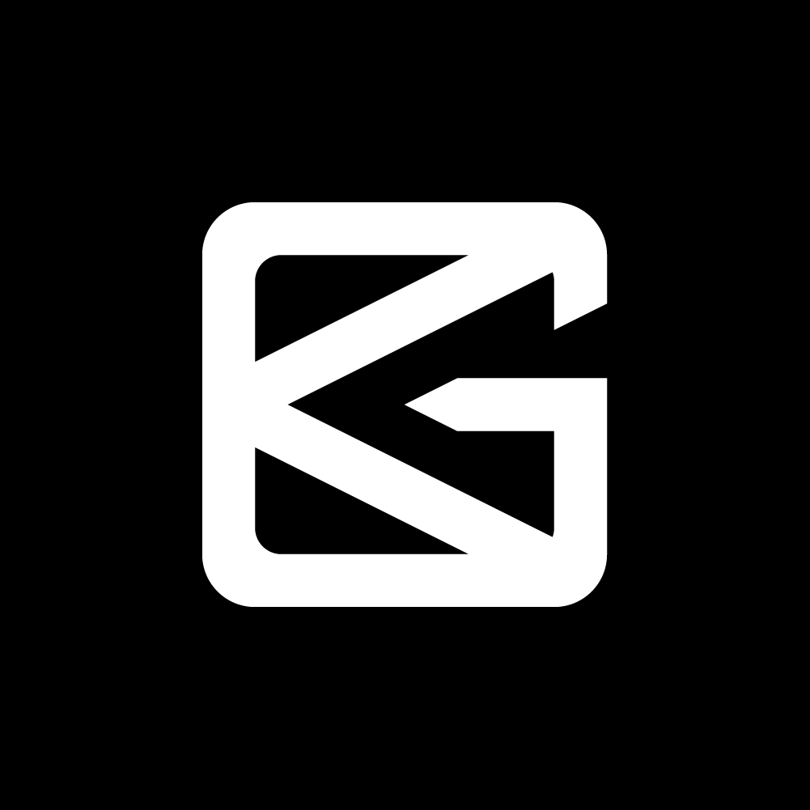

<div align="center">
  <a href="https://braingame.com">
    
  </a>
  
  <h1>Brain Game</h1>
  
  <p>
    <strong>The operating system for personal development.</strong>
  </p>
  
  <p align="center">
    
    
    
    
    
  </p>
</div>


This monorepo contains the code for all Brain Game applications, websites, and shared libraries. It includes a comprehensive mindset training platform with advanced features and enterprise-grade architecture.

---

## 🚀 Quick Links

| Need to... | Go to |
|------------|-------|
| Set up your dev environment | [Development Guide](./docs/DEVELOPMENT.md) |
| Check current tasks | [TODO List](./docs/TODO.md) |
| Find a component | [Component Reference](./docs/COMPONENT_REFERENCE.md) |
| Report a bug | [Security Policy](./.github/SECURITY.md) |
| Understand the architecture | [Architecture Docs](./docs/ARCHITECTURE.md) |
| Learn from past work | [Lessons Learned](./docs/LESSONS.md) |

---

## 🚀 Get Started

To get a local copy up and running, follow our comprehensive **[Development Guide](./docs/DEVELOPMENT.md)**. It contains everything you need for setup, from prerequisites to running the apps.

Before running any lint or test commands, make sure your dependencies are installed:

```bash
pnpm install    # or pnpm run preflight
```

For complete documentation including architecture, coding standards, and contribution guides, visit our **[Documentation Hub](./docs/README.md)**.

---

## ⚡ Quick Start

```bash
# Clone the repository
git clone https://github.com/braingame-com/braingame.git
cd braingame

# Verify workspace (CRITICAL - prevents contamination)
bash scripts/check-workspace.sh

# Install dependencies
nvm use  # Use correct Node version
pnpm install

# Run everything
pnpm dev

# Or run specific apps
pnpm dev --filter product  # Expo app
pnpm dev --filter website  # Next.js site
```

**🚨 Important**: Always verify your workspace before starting work. See [WORKTREES.md](./docs/WORKTREES.md) for details.

---

## 🧠 Guiding Principles

- **Enterprise-Grade by Default:** We build robust, scalable, and maintainable software that meets Fortune 500 quality standards from day one.
- **Pragmatic & Ambitious:** We use proven technologies and patterns to solve problems, but we are not afraid to innovate where it matters.
- **Documentation is Law:** Our `docs` folder is not just a suggestion; it is the single source of truth for how we build, architect, and collaborate.

---

## 📂 What's Inside?

This repository is a [Turborepo](https://turbo.build/repo) monorepo using [pnpm workspaces](https://pnpm.io/workspaces). It contains:

| Path | Description |
|---|---|
| `apps/product` | The universal **Expo client** for iOS, Android, and Web. Features a complete mindset training platform with vision & goals, affirmations, visual inspiration, and performance tracking. |
| `apps/website` | The **Next.js marketing site** and documentation hub. |
| `packages/bgui` | Our **enterprise-grade component library** with 25+ components, built with React Native and `react-native-web`. Features full TypeScript support, accessibility, and theme integration. |
| `packages/utils` | Shared utilities, hooks, design tokens, and helpers used across the monorepo. Includes theme system, animation constants, and task management utilities. |
| `packages/config` | Shared configurations for TypeScript, Biome, etc. |
| `docs` | All project documentation, from architecture to coding style. |

---

## 🎯 Key Features

### Mindset Training Platform
- **Vision & Goals System**: 5-area life planning with structured goal setting
- **Affirmations System**: Audio and text affirmations with background music
- **Visual Inspiration**: 50+ motivational images with slideshow navigation
- **Performance Tracking**: Habit tracking, health metrics, and activity scores
- **Data Persistence**: Google Sheets backend integration for reliable storage

### Technical Highlights
- **100+ Components**: Comprehensive UI library with enterprise-grade quality
- **Cross-Platform**: Single codebase for iOS, Android, and Web
- **TypeScript**: 100% TypeScript with strict mode enabled
- **Design System**: Complete token system for spacing, colors, and typography
- **Accessibility**: Full ARIA support and keyboard navigation
- **Performance**: 60fps animations with optimized bundle sizes
- **Testing**: Comprehensive test coverage across all packages

### Recent Enhancements (2025)
- Successfully migrated valuable features from legacy projects
- Created 70+ new components with enterprise architecture
- Implemented advanced features including YouTube integration, data visualization, and dynamic theming
- Enhanced BGUI library with 3 custom hooks and standardized patterns
- Established comprehensive testing and documentation systems

---

## 🤝 Contributing

We welcome contributions! Please see our **[Contributing Guide](./.github/CONTRIBUTING.md)** for the full process, including our code of conduct, PR process, and commit conventions.

A key part of our workflow is our task management system. See what we're working on in our **[TODO list](./docs/TODO.md)**.

## 🛡️ Security

Security is a top priority. Please see our **[Security Policy](.github/SECURITY.md)** for details on our supported versions and how to report vulnerabilities.

## 📄 License

This project is licensed under the MIT License. See the **[LICENSE](./LICENSE)** file for details.
