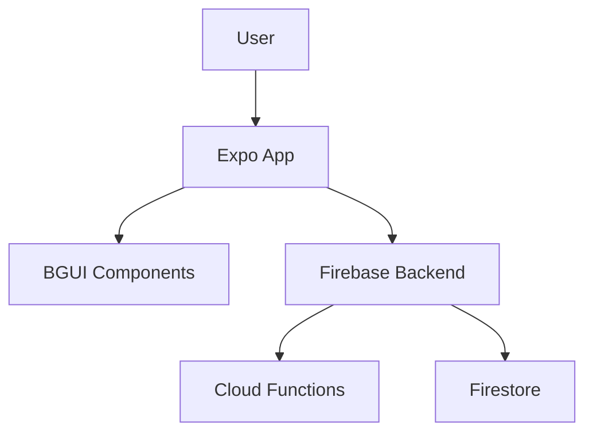

# Documentation Improvements Guide

**Date Created:** 21-06-2025  
**Author:** AI Review Agent  
**Purpose:** Important improvements for Brain Game documentation

---

## 🎯 Executive Summary

Your documentation is already **enterprise-grade** with excellent structure and consistency. However, I've identified several important improvements that would elevate it further:

1. **Missing Critical Documents** - Security policies, deployment guides, API documentation
2. **Incomplete README Files** - Several packages lack proper README documentation
3. **Outdated Content** - Some references to removed features and old dates
4. **Knowledge Gaps** - Missing troubleshooting guides and FAQ sections
5. **Process Documentation** - Need for more operational runbooks

---

## 🚨 Critical Missing Documentation

### 1. **Production Deployment Guide** (HIGH PRIORITY)
Currently missing comprehensive deployment documentation for:
- Firebase Hosting deployment process
- Environment variable management in production
- CI/CD pipeline configuration for releases
- Rollback procedures
- Health checks and monitoring setup

**Recommendation:** Create `/docs/DEPLOYMENT.md` with:
```markdown
# Deployment Guide

## Prerequisites
- Required permissions and access
- Environment setup checklist

## Deployment Process
### 1. Pre-deployment Checks
### 2. Staging Deployment
### 3. Production Deployment
### 4. Post-deployment Verification

## Rollback Procedures
## Monitoring & Alerts
```

### 2. **API Documentation** (HIGH PRIORITY)
No documentation for:
- Firebase Cloud Functions API
- Google Sheets integration endpoints
- YouTube API service methods
- Authentication flows

**Recommendation:** Create `/docs/API.md` or use OpenAPI/Swagger

### 3. **Security Runbook** (CRITICAL)
While `.github/SECURITY.md` exists, you need:
- Incident response procedures
- Security checklist for code reviews
- Secrets rotation schedule
- Dependency update process

**Recommendation:** Create `/docs/SECURITY_RUNBOOK.md`

---

## 📝 Documentation Quality Issues

### 1. **Inconsistent Date Formats**
Despite the DD-MM-YYYY rule, found inconsistencies:
- `TESTING.md`: Uses "21-06-2024" (should be 2025)
- Some work sessions use YYYY-MM-DD in filenames but DD-MM-YYYY in content

**Fix:** Audit all dates and ensure consistency

### 2. **Missing Package READMEs**
Several packages have inadequate README files:
- `/packages/bgui/README.md` - Needs usage examples, component list
- `/packages/utils/README.md` - Missing API documentation
- `/packages/config/README.md` - Doesn't exist

**Template for Package READMEs:**
```markdown
# @braingame/[package-name]

> Brief description of package purpose

## Installation
\`\`\`bash
pnpm add @braingame/[package-name]
\`\`\`

## Usage
\`\`\`typescript
// Example code
\`\`\`

## API Reference
### Functions/Components
- `functionName()` - Description

## Contributing
See [CONTRIBUTING.md](../../CONTRIBUTING.md)
```

### 3. **Outdated References**
- `ARCHITECTURE.md` mentions "minimal Jest test suite" but extensive tests now exist
- `TODO.md` has completed items that should be moved to a "Completed" section
- Some docs reference "UNUSED_EXPORTS.md" which was deleted

---

## 🔧 Documentation Enhancements

### 1. **Add Troubleshooting Guide**
Create `/docs/TROUBLESHOOTING.md`:
- Common setup issues and solutions
- Build errors and fixes
- Platform-specific problems
- Dependency conflicts resolution

### 2. **Create FAQ Document**
Address common questions:
- Why Biome over ESLint?
- Why pnpm over npm/yarn?
- How to add new components?
- Architecture decisions explained

### 3. **Improve Work Session Documentation**
Current work sessions are good but could be better:
- Add "Time Spent" tracking
- Include "Resources Consulted" section
- Add "Performance Impact" for changes
- Create quarterly summaries

### 4. **Add Visual Documentation**
- Architecture diagrams (use Mermaid in markdown)
- Component hierarchy visualization
- Data flow diagrams
- Deployment pipeline flowchart

**Example:**


---

## 📚 Documentation Organization

### 1. **Create Documentation Index**
While `/docs/README.md` exists, enhance it with:
- Document categorization (Getting Started, Architecture, Operations, etc.)
- Reading order for new developers
- Document maturity indicators
- Last reviewed dates

### 2. **Standardize Document Headers**
Every document should have:
```markdown
# Document Title

> One-line description

**Last Updated:** DD-MM-YYYY  
**Status:** Draft | Review | Stable | Deprecated  
**Audience:** Developers | Architects | Operations | All  

---
```

### 3. **Add Change Log to Key Documents**
Track changes to critical docs:
```markdown
## Change Log
- **21-06-2025:** Updated deployment process - @agent
- **20-06-2025:** Initial creation - @human
```

---

## 🎓 Knowledge Transfer

### 1. **Create Onboarding Checklist**
New developer checklist in `/docs/ONBOARDING.md`:
- [ ] Environment setup complete
- [ ] Read architecture docs
- [ ] Run sample commands
- [ ] Complete first PR
- [ ] Review coding standards

### 2. **Add Decision Records**
Create `/docs/decisions/` directory for ADRs:
- `001-why-biome.md`
- `002-monorepo-structure.md`
- `003-state-management.md`

### 3. **Document Tribal Knowledge**
Capture undocumented patterns:
- Why certain architectural choices were made
- Common gotchas and their solutions
- Performance optimization techniques used
- Testing strategies and trade-offs

---

## 🔄 Process Improvements

### 1. **Documentation Review Cycle**
- Quarterly documentation audits
- Automated link checking in CI
- Documentation coverage metrics
- Stale content warnings

### 2. **Documentation as Code**
- Add documentation linting (markdownlint)
- Spell checking in CI
- Automated TOC generation
- Documentation preview in PRs

### 3. **Living Documentation**
- Auto-generate component docs from TypeScript
- API docs from code comments
- Dependency graphs from package.json
- Test coverage reports in docs

---

## ✅ Quick Wins (Do These First)

1. **Fix all date inconsistencies** (30 min)
2. **Create missing package READMEs** (2 hours)
3. **Add troubleshooting guide** (1 hour)
4. **Update outdated references** (1 hour)
5. **Create deployment guide** (2 hours)

---

## 📊 Documentation Metrics

Consider tracking:
- Documentation coverage (files with docs / total files)
- Documentation freshness (last update date)
- Documentation completeness (required sections present)
- Documentation usage (page views, search queries)

---

## 🎯 Long-term Vision

Your documentation should:
1. **Self-serve 80% of questions** - Reduce interruptions
2. **Onboard developers in < 1 day** - Fast productivity
3. **Prevent repeated mistakes** - Capture learnings
4. **Enable confident changes** - Clear architecture
5. **Facilitate debugging** - Comprehensive guides

---

## 💡 Final Recommendations

1. **Prioritize user journeys** - Organize docs by what people need to do
2. **Show, don't just tell** - More code examples and diagrams
3. **Test your docs** - Have someone new follow them
4. **Keep it DRY** - Single source of truth, link don't duplicate
5. **Make it searchable** - Good titles, headers, and keywords

Your documentation is already strong - these improvements will make it exceptional!