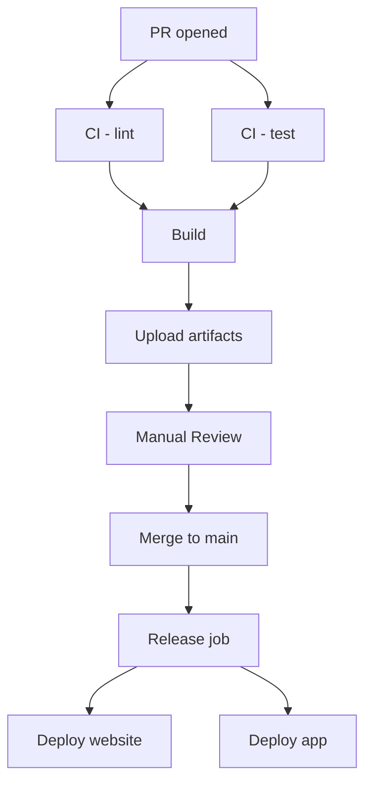

# DEVOPS_PIPELINE_REVIEW-c2f6bcf9.md

Date: 24-06-2025

## Findings
- **Branch strategy**: repository uses a trunk-based flow with feature branches off `main` for both human and AI contributors. Worktrees isolate development to avoid conflicts.
- **CI pipeline**: GitHub Actions with jobs for lint, test, build and typecheck. Build artifacts uploaded as part of CI. Release workflow deploys website via Firebase and the Expo app via EAS. Turbo tasks provide caching but remote cache is optional. No explicit parallel test shards or cache statistics exposed.
- **CD strategy**: Deploys to production on merges to `main` without staging canary or blue-green phases. No feature flag rollout beyond planned LaunchDarkly integration.
- **Rollback procedure**: Not documented; deployments rely on CI success. Incident response and rollback runbooks not present.
- **Observability**: Sentry for error tracking with basic performance metrics. Logs and metrics pipelines are minimal; no defined SLOs.

## Recommendations
1. **Branch Strategy**
   - Adopt strict trunk-based development with short-lived feature branches and frequent integration. Document merge windows and commit hygiene.
2. **CI Enhancements**
   - Enable Turbo remote caching to improve cache hits across PRs.
   - Parallelise test suites using matrix jobs and consider sharding large test sets.
   - Record cache statistics and test flake rates in CI summaries.
3. **CD Improvements**
   - Introduce canary deployments for both website and app before a full rollout.
   - Implement feature flags (LaunchDarkly) to decouple releases from deploys.
   - Evaluate blue-green infrastructure for website hosting.
4. **Rollback & Incidents**
   - Define automated rollback steps (e.g., re-deploy previous successful artifact) with manual approval gates.
   - Establish an incident response playbook with on-call escalation.
5. **Observability Upgrades**
   - Centralise logs via a structured logging pipeline (e.g., Cloud Logging/ELK).
   - Add metrics and distributed tracing (OpenTelemetry) across services.
   - Define SLOs for build success, deploy latency and error budgets. Surface dashboards in CI summaries.

## Diagrams

### Current Pipeline


### Proposed Pipeline
```mermaid
graph TD
  A[PR opened] --> B[CI - lint & typecheck]
  A --> C[CI - test (parallel shards)]
  B --> D[Build with remote cache]
  C --> D
  D --> E[Preview deploy - canary]
  E --> F[Automated checks + QA]
  F --> G[Merge to main]
  G --> H[Blue/Green rollout]
  H --> I[Feature flags enable]
  I --> J[Monitoring & SLO dashboards]
  J --> K[Automated rollback if failure]
```

## 90-Day Migration Plan

1. **0‑30 Days**
   - Set up Turbo remote caching service and track cache hit metrics.
   - Review existing tests and stabilise flakiness; enable parallel job matrix.
   - Document basic rollback steps and create incident response contacts.
2. **31‑60 Days**
   - Integrate LaunchDarkly for feature flags across apps.
   - Configure canary environments for website and API; gate on success before full deploy.
   - Centralise logging with a managed service and add basic dashboards.
3. **61‑90 Days**
   - Implement blue‑green deployments for website hosting.
   - Add distributed tracing via OpenTelemetry and create SLO dashboards in Grafana.
   - Finalise automated rollback scripts and conduct incident response drills.
